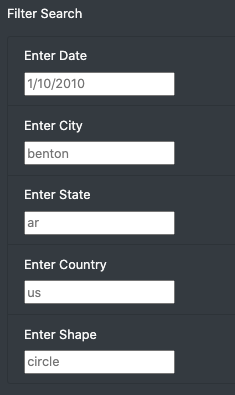
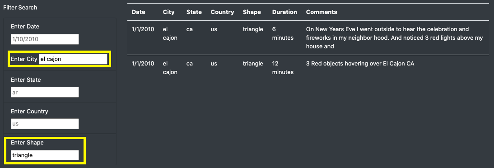

# UFOs

## Overview of Project
This project will visualize a JavaScript data file about UFO sightings in a HTML page that will allow users of the webpage to search and filter using the criteria that they are interested in.

### Purpose
Using JavaScript, HTML, and Bootstrap, a dynamic webpage was created to detail information on UFO sightings that accepts user inputs and changes based on these inputs. The webpage includes a general description of the main project, *The Truth is Out There*, which shares numerous logs of UFO sightings including information on the sighting date, the city, the state, and the country of the sighting and some additional details about the sighting including the shape, the duration and general comments. The logs of UFO sightings are stored in a table.

__Figure 1 – *The Truth is Out There Webpage*__

## Results
Upon arriving at the webpage, the user will find a structured interface that includes the above general details which summarize the origins and support of the UFO sighting data as well as some information on local community outcry on the publication and use of the data.

At the top-left of the webpage, there is a basic navigation bar that allows the user to reset the page once clicked.

__Figure 2 – *Navigation Bar*__

Along the left of the webpage, there are some Filter Search options for the user to filter through the massive amount of UFO sighting data to narrow down to any data that they would like to see. Users can filter by the date, city, state, country and shape of the sighting. 

__Figure 3 – *Filter Search*__

The filters can be used individually or combined to refine results. In *Example 1* below, the data table is filtered on a single criterion, the city “el cajon”, which returns five results. To refine this, the user can enter another parameter. In *Example 2* below, an additional criterion is entered; perhaps the user is looking for sightings that have a “triangle” shape. Upon doing so, there are now two results which match both parameters.

__Example 1 – *City Filter*__

__Example 2 – *City and Shape Filter*__

## Summary
While this dynamic webpage allowed users to interact with the UFO sightings data by filtering by desired parameters such as date, city, state, country, and shape, there are some drawbacks to the usability of the webpage. At this time, the webpage only allows for the user to enter in a specific sighting date, and not a date range. A recommendation would be to allow the user to enter in a range for the date filter so that they can view data for multiple dates. Additionally, another drawback is that each filter field only accepts one input from the user, restricting the user from accessing multiple data points. For example, if the date chosen is “1/1/2010”, the user may be interested in viewing the sighting information from two cities or three shapes specifically on that date. The webpage can be updated to allow for multiple search criteria to be entered by the user in each of the filter fields. This allows for a greater degree of customization for anyone browsing *The Truth is Out There* webpage.